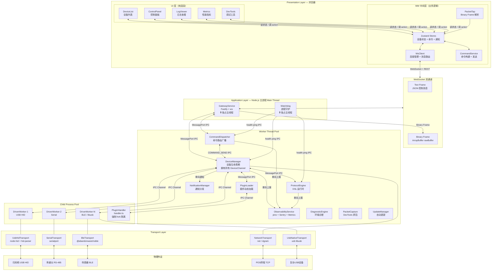

# DevBridge 系统整体架构图

> 展示三层架构、线程模型（主线程 / Worker Thread / Child Process）、Transport 层与物理设备的连接关系。

## 关键设计决策

| 决策 | 说明 |
|------|------|
| GatewayService 独占主线程 | 保证 HTTP/WS I/O 响应不被设备扫描等耗时操作阻塞 |
| 浏览器端 UI / MW 双层分离 | UI 层只读 Zustand Store + 调 action；MW 层持有 WsClient、业务逻辑、Binary Frame 解析，无 JSX 依赖 |
| DeviceChannel 所有权归 DeviceManager | CommandDispatcher 通过 IPC 委托，消除跨 Worker 循环依赖 |
| handler.ts 强制 Child Process | 插件业务代码完全隔离，崩溃不影响主进程 |
| rawBuffer 走 Binary Frame | 零编码开销，前端 DevTools 直接操作 ArrayBuffer |
