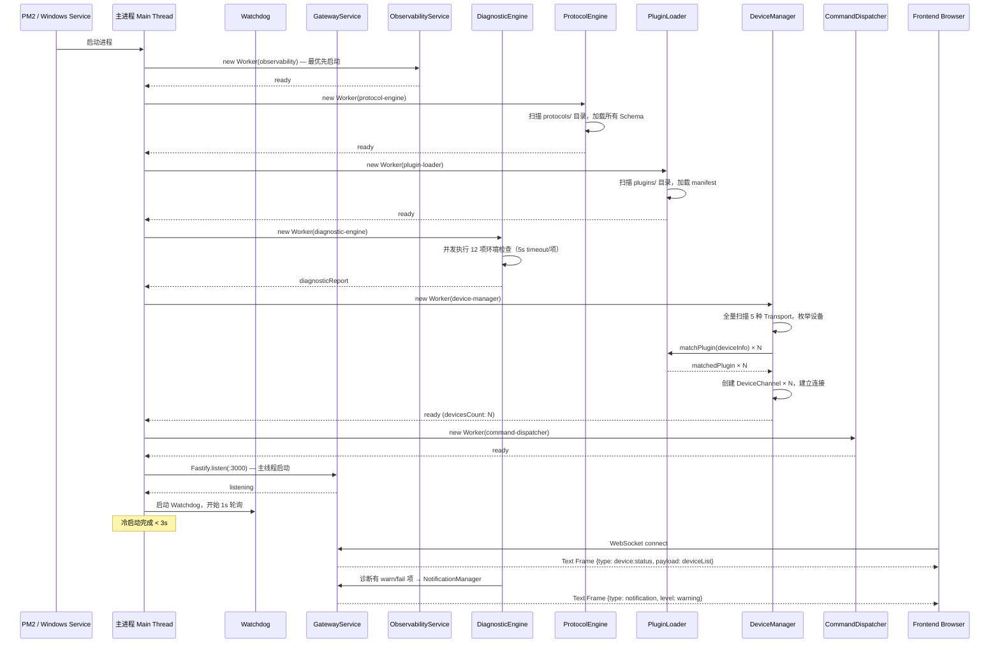

# 冷启动流程（Cold Start Sequence）

> 从 PM2/Windows Service 启动到服务就绪、前端首次连接的完整时序。  
> **SLA 目标：< 3s**

## Worker 启动顺序（拓扑依赖顺序）

| 顺序 | Service | 原因 |
|------|---------|------|
| 1 | ObservabilityService | 所有其他 Service 的日志依赖它，最先启动 |
| 2 | ProtocolEngine | PluginLoader 和 DeviceManager 都需要它加载完成 |
| 3 | PluginLoader | DeviceManager 需要匹配插件 |
| 4 | DiagnosticEngine | 独立运行，不阻塞后续，但结果影响 Transport 启动 |
| 5 | DeviceManager | 核心，最耗时（全量设备扫描） |
| 6 | CommandDispatcher | 依赖 DeviceManager 已有设备列表 |
| 7 | GatewayService | 最后启动，所有后端就绪后才开放外部连接 |
| 8 | Watchdog | 所有 Service 就绪后开始监控 |

## 关闭顺序（逆序）

`GatewayService → CommandDispatcher → DeviceManager → PluginLoader → ProtocolEngine → ObservabilityService`
