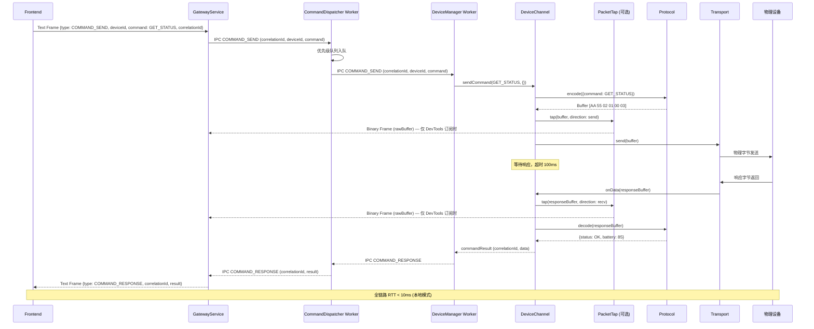

# 命令发送流程（Command Channel — 请求响应）

> 前端发送命令到设备，等待响应的完整链路。  
> **SLA 目标：单设备 < 1ms 发送延迟，本地 RTT < 10ms**



## 超时降级策略

- 默认超时 **100ms**
- 超时后该设备命令返回 `{ status: 'timeout', deviceId }`，不阻塞其他设备
- `NotificationManager` 记录超时事件，超时率连续超阈值触发 `warning` 通知

## correlationId 追踪链路

```
Frontend correlationId (UUID v4)
  → GW IPC → CD IPC → DM IPC → DeviceChannel
  ← DM IPC ← CD IPC ← GW IPC ← DeviceChannel
```

全链路使用同一 `correlationId`，任意环节的日志均可通过它关联。
