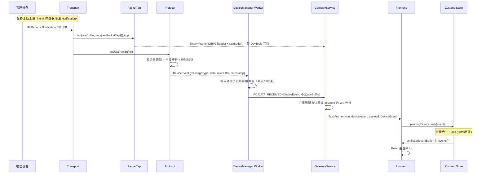

# 设备事件流程（Event Channel — 被动上报）

> 设备主动推送数据（扫码、传感器读数、BLE Notification）到前端的完整链路。  
> 包含 PacketTap 插入点和前端高频节流策略。



## PacketTap 零开销设计

```
PacketTap 未开启  → tap() 调用直接返回，无任何分配操作
PacketTap 已开启  → tap() 编码 Binary Frame Header + 发送 rawBuffer
```

PacketTap 的开关状态由 GatewayService 维护，每个 DeviceChannel 独立控制。

## 前端高频节流策略

BLE 传感器等设备可能以 **100Hz** 频率推送数据，若每条消息触发 React 重渲染会导致 UI 卡顿。

采用**批量 16ms 合并**策略（约 60fps）：

```typescript
const BATCH_INTERVAL_MS = 16;
let pendingEvents: DeviceEventPayload[] = [];

function onDeviceEvent(event: DeviceEventPayload) {
  pendingEvents.push(event);
  scheduleFlush(); // 16ms 内只调度一次 setState
}
```

- 事件缓冲区最多保留最近 **200 条**（避免内存无限增长）
- UI 层按需取用，不强制全量渲染

## 通信历史写入

每条 DeviceEvent 同时写入**内存环形缓冲区**（每设备最近 1000 条），可通过以下方式查询：

- `GET /api/v1/devices/:id/history`
- 可选持久化到 SQLite（`better-sqlite3`）
