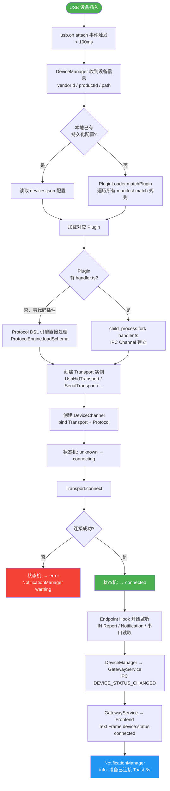

# 设备发现与连接流程（热插拔 Attach）

> 从物理设备插入到出现在前端设备列表的完整流程。  
> **SLA 目标：USB 热插拔检测 < 100ms，Serial 轮询 ≤ 1s**



## 各 Transport 热插拔检测机制

| Transport | 检测机制 | 延迟 |
|-----------|---------|------|
| USB HID | `usb.on('attach/detach')` 原生事件 | **< 100ms** |
| USB Native | `usb.on('attach/detach')` 原生事件 | **< 100ms** |
| Serial | 轮询 `SerialPort.list()` 差异比对 | **≤ 1s**（轮询间隔可配置）|
| BLE | RSSI 超时 + `noble.on('discover')` 扫描 | **5-10s**（软性检测）|
| TCP/UDP | 心跳超时 + mDNS 消失 + socket `close/error` | **1-30s**（心跳间隔可配置）|

## Plugin 匹配规则（manifest.match 字段）

```jsonc
{
  "match": {
    "pnpId": "USB\\VID_1234&PID_5678",  // USB VID/PID 精确匹配
    "baudRate": 9600,                     // 串口波特率
    "deviceNameFilter": "MySensor"        // BLE 设备名前缀
  }
}
```

未匹配到任何 Plugin 时，设备以"未知设备"状态显示，可手动在前端绑定插件。
