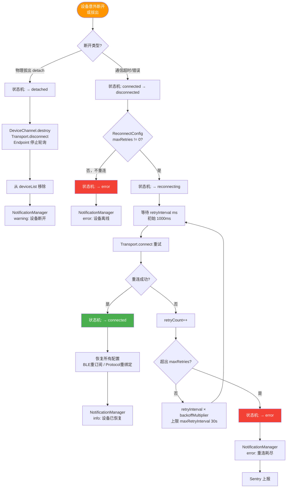

# 设备断开与自动重连流程

> 设备意外断开后的状态机流转与指数退避重连策略。



## 重连配置（ReconnectConfig）

```typescript
interface ReconnectConfig {
  maxRetries: number;        // -1 = 无限重连，0 = 不重连，默认 5
  retryInterval: number;     // 初始间隔 ms，默认 1000
  backoffMultiplier: number; // 指数退避倍数，默认 2
  maxRetryInterval: number;  // 最大间隔，默认 30000ms
  reconnectOn: ('detach' | 'disconnect' | 'error')[];
}
```

## 指数退避示例

| 第 N 次重试 | 等待时间 |
|------------|---------|
| 1 | 1s |
| 2 | 2s |
| 3 | 4s |
| 4 | 8s |
| 5 | 16s |
| 6+ | 30s（上限）|

## 重连成功后的恢复

- 保留设备所有配置（Protocol Schema、BLE 订阅列表、Report ID 路由）
- BLE 重连后重新执行 GATT 服务发现和 Characteristic 订阅
- 通信历史记录保留（连续性，不清空）
