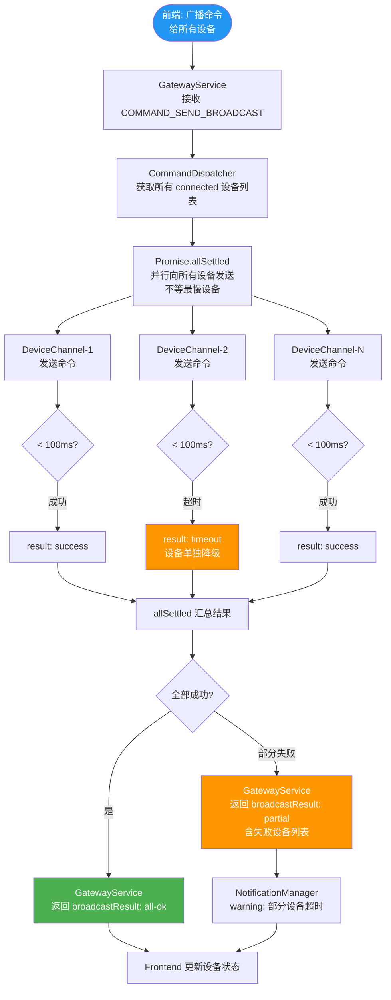

# 命令广播流程（多设备并行 — Promise.allSettled）

> 向所有已连接设备并行广播同一命令，超时设备独立降级，不阻塞其他设备。  
> **SLA 目标：≤ 10 台设备广播延迟 ≤ 5ms**



## 为什么用 Promise.allSettled 不用 Promise.all

| | `Promise.all` | `Promise.allSettled` ✅ |
|--|--------------|----------------------|
| 单设备失败 | 整体 reject，其他设备结果丢失 | 继续等待其他设备，收集所有结果 |
| 适用场景 | 全部必须成功 | 尽力而为，允许部分失败 |
| 广播场景 | ❌ 不适合 | ✅ 适合 |

## 热路径优化

```
广播路径全程禁止:
  × JSON.stringify/parse        → 用 Buffer 二进制
  × Date.now()                  → 用 process.hrtime.bigint()
  × Buffer.alloc() 动态分配     → Buffer Pool 预分配
  × console.log                 → pino ring buffer 异步写
```

## 广播结果格式

```typescript
interface BroadcastResult {
  total: number;
  succeeded: string[];   // deviceId 列表
  failed: Array<{
    deviceId: string;
    reason: 'timeout' | 'error';
    errorCode?: string;
  }>;
  elapsedNs: bigint;     // process.hrtime.bigint() 精度
}
```
