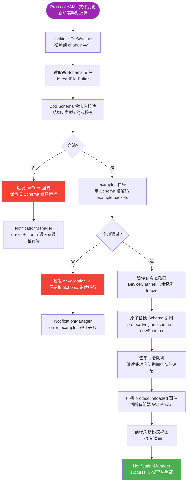

# 协议热重载流程

> 运行时动态更新 Protocol DSL Schema，无需重启服务，不中断已连接设备通信。  
> **SLA 目标：文件变更到生效 < 200ms；切换期间丢包 = 0**



## 热重载安全保障

```
1. 校验 → examples 自检 → 原子替换  （三道关卡，任一失败回滚）
2. Schema 替换期间冻结命令队列（< 1ms），解冻后队列自动回放
3. 新旧 Schema 引用切换为原子操作（单赋值，无中间态）
4. 异常路径：保留旧 Schema，不影响正在运行的设备通信
```

## 支持的热重载触发方式

| 触发方式 | 场景 |
|---------|-----|
| chokidar 文件监听 | 开发时本地编辑 YAML 立即生效 |
| 前端上传新 Schema | 生产环境远程升级 |
| REST `POST /api/protocol/reload` | CI/CD 自动化触发 |

## Protocol DSL Schema 简例

```yaml
protocol: MyDevice v1.0
commands:
  - id: 0x01
    name: setLed
    fields:
      - name: color
        type: uint8
        range: [0, 7]
  - id: 0x02
    name: getStatus
    response: DeviceStatus
```
