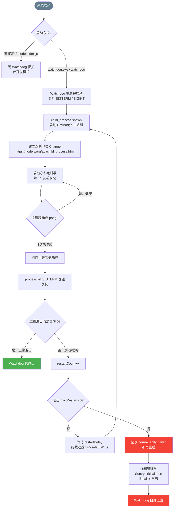

# Watchdog 进程守护与自愈流程

> Watchdog 与 DevBridge 主进程的守护关系、心跳检测及自动重启策略。



## Watchdog 配置

```typescript
interface WatchdogConfig {
  heartbeatInterval: number;   // ms，默认 1000
  heartbeatTimeout: number;    // 连续无响应次数，默认 3
  maxRestarts: number;         // 最大重启次数，默认 5
  restartDelay: number;        // 初始重启延迟 ms，默认 1000
  backoffMultiplier: number;   // 默认 2 （指数退避）
  exitOnFail: boolean;         // permanently_failed 后 Watchdog 是否退出，默认 true
}
```

## 主进程心跳响应（DevBridge 侧）

```typescript
// 主进程监听 Watchdog 心跳
process.on('message', (msg) => {
  if (msg === 'ping') {
    process.send?.('pong');
  }
});
```

## 重启日志格式

```json
{
  "event": "process_restart",
  "restartCount": 2,
  "reason": "heartbeat_timeout",
  "pid": 12345,
  "exitCode": null,
  "signal": "SIGTERM",
  "nextRestartDelay": 4000,
  "timestamp": "2025-01-01T00:00:00.000Z"
}
```
