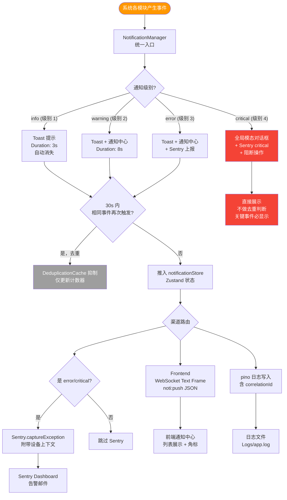

# 异常通知分发流程（4 级别）

> 运行时所有异常、告警、信息经 NotificationManager 统一路由，支持去重与多渠道输出。



## 通知级别定义

| 级别 | 名称 | 时效 | Toast 时长 | Sentry | 场景示例 |
|------|------|------|-----------|--------|---------|
| 1 | `info` | 瞬时 | 3s | ❌ | 设备已连接、配置保存成功 |
| 2 | `warning` | 短暂 | 8s | ❌ | 设备响应超时、协议解析警告 |
| 3 | `error` | 持久 | 手动关闭 | ✅ | 设备连接失败、Schema 校验出错 |
| 4 | `critical` | 阻断 | 需确认 | ✅ critical | 进程崩溃、权限不足、磁盘满 |

## 去重策略（DeduplicationCache）

```typescript
interface DedupeKey {
  source: string;      // 模块名，如 "DeviceManager"
  eventCode: string;   // 事件码，如 "DEVICE_CONNECT_FAIL"
  deviceId?: string;   // 设备维度隔离去重
}

// 30s 内同一 key 最多触发 1 次通知
const DEDUPE_WINDOW_MS = 30_000;
```

## 通知事件格式（WebSocket Text Frame）

```json
{
  "event": "noti:push",
  "data": {
    "id": "noti_01HXYZ",
    "level": "warning",
    "title": "设备响应超时",
    "message": "Device:3f2a 在 100ms 内未响应，自动重连中...",
    "source": "CommandDispatcher",
    "correlationId": "req_abc123",
    "timestamp": "2025-01-01T00:00:00.000Z"
  }
}
```
