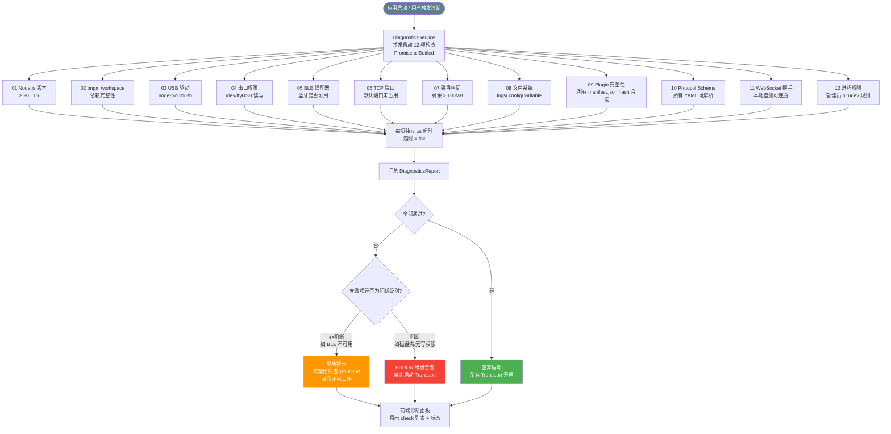

# 环境诊断流程（12 项并发检查）

> 应用启动时并发执行 12 项环境检查，超时或失败的检查项可视情况阻断 Transport 启动。



## 12 项检查详情

| # | 检查项 | 阻断级别 | Transport 影响 |
|---|--------|---------|--------------|
| 01 | Node.js 版本 ≥ 20 | 🔴 阻断所有 | 全部 |
| 02 | pnpm 依赖完整性 | 🔴 阻断所有 | 全部 |
| 03 | USB 驱动 (libusb) | 🟡 仅禁用 USB | USB HID / USB Native |
| 04 | 串口权限 | 🟡 仅禁用串口 | Serial |
| 05 | BLE 适配器 | 🟡 仅禁用 BLE | BLE |
| 06 | TCP 端口可用 | 🟠 禁用 TCP/UDP | TCP / UDP |
| 07 | 磁盘空间 > 100MB | 🔴 阻断所有（无法写日志）| 全部 |
| 08 | 文件系统可写 | 🔴 阻断所有 | 全部 |
| 09 | Plugin 完整性 | 🟡 禁用损坏插件 | 对应设备 |
| 10 | Protocol Schema 可解析 | 🟡 禁用对应设备 | 对应设备 |
| 11 | WebSocket 自测 | 🟠 禁用前端推送 | GatewayService |
| 12 | 进程权限 | 🟡 禁用需权限的 Transport | USB / Serial |

## 诊断结果格式

```typescript
interface DiagnosticsReport {
  timestamp: string;
  elapsedMs: number;
  items: Array<{
    id: string;           // 如 "usb-driver"
    name: string;
    status: 'pass' | 'warn' | 'fail' | 'timeout';
    message?: string;
    blocking: boolean;    // true = 阻断对应 Transport
    affectedTransports: TransportType[];
  }>;
  canStart: boolean;      // true = 无阻断项
}
```
