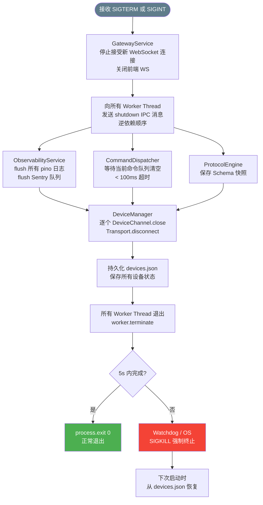
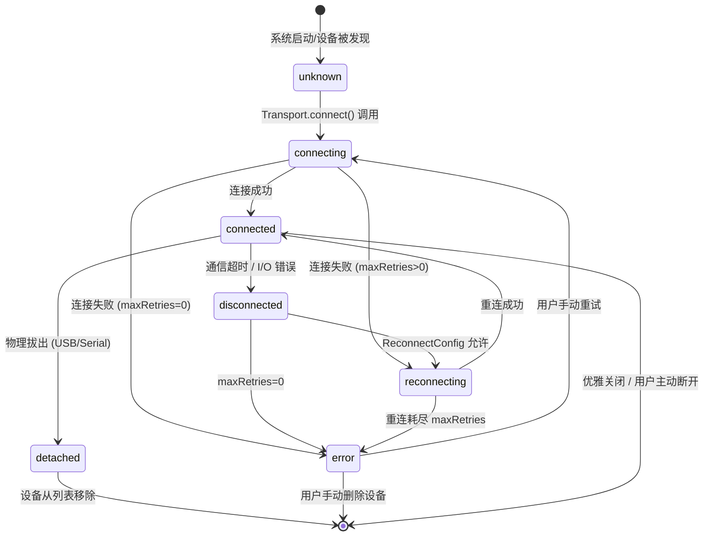

# 优雅关闭流程与设备状态机全貌

## 一、优雅关闭流程（Graceful Shutdown）

> 收到 SIGTERM / SIGINT 后，按逆序停止各 Worker Thread，确保所有设备配置已持久化再退出。  
> **SLA 目标：强制 SIGKILL 前等待 5s 完成所有清理**



## 二、设备状态机全貌



## 状态说明

| 状态 | 含义 | UI 展示 |
|------|------|---------|
| `unknown` | 已发现设备，尚未建立连接 | ⚪ 灰色 |
| `connecting` | 正在建立连接 | 🔵 蓝色旋转 |
| `connected` | 通信正常 | 🟢 绿色 |
| `disconnected` | 通信中断，等待重连判断 | 🟡 黄色 |
| `reconnecting` | 指数退避中，主动重连 | 🟠 橙色旋转 |
| `detached` | 物理移除，临时状态 | — |
| `error` | 最终失败，需人工干预 | 🔴 红色 |

## 关闭顺序（逆依赖）

```
1. GatewayService（停止对外服务，最先关闭）
2. ObservabilityService（flush 日志，避免丢失）
3. CommandDispatcher（清空命令队列）
4. ProtocolEngine（保存 Schema 快照）
5. DeviceManager（关闭所有 DeviceChannel 和 Transport，最后关闭）
```
